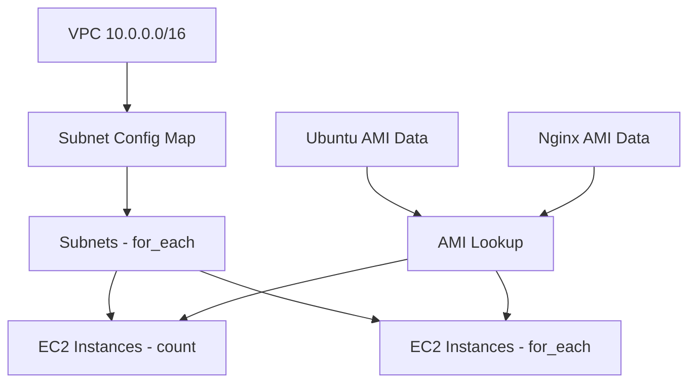
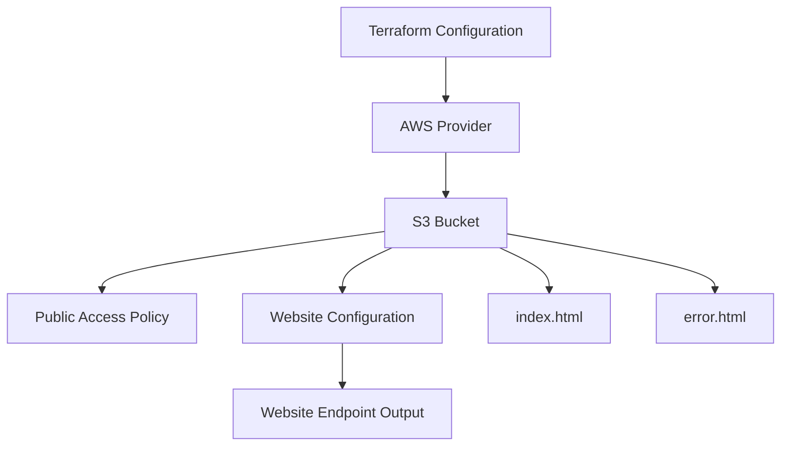

# Mastering Terraform: From Beginner to Expert

### Course link (with a big discount 🙂): https://www.lauromueller.com/courses/mastering-terraform

**Check my other courses:** 

- 👉 The Complete Docker and Kubernetes Course: From Zero to Hero - https://www.lauromueller.com/courses/docker-kubernetes
- 👉 The Definitive Helm Course: From Beginner to Master - https://www.lauromueller.com/courses/definitive-helm-course
- 👉 Mastering GitHub Actions: From Beginner to Expert - https://www.lauromueller.com/courses/mastering-github-actions
- 👉 Write better code: 20 code smells and how to get rid of them -  https://www.lauromueller.com/courses/writing-clean-code

Welcome everyone! I'm very happy to see you around, and I hope this repository brings lots of value for those learning more about Terraform. Make sure to check the link above for a great discourse on the course in Udemy, where I not only provide theoretical explanations around all the concepts here, but also go in details through the entire coding of the examples in this repository.

Here are a few tips for you to best navigate the contents of this repository:
1. The `exercises` folder contains descriptions for all the implemented exercises. You can use it as a guide to try to implement them by yourself before following the solution recordings.
2. The `projects` folder contains six bigger projects that you can also tackle for an extra challenge 🙂 The solutions for these projects are implemented within their respective folders, **except for project 00, which is implemented inside of the folder `06-resources`**.
3. The other folders roughly mirror the structure of the course, but there are some course sections that span more than one folder.

Happy learning! 🚀

## Additional Links and Courses:

**Other repositories included in the course:**
* Networking Module Repository - https://github.com/lm-academy/terraform-aws-networking-tf-course
* Terraform Cloud VCS Integration Repository - https://github.com/lm-academy/terraform-course-example-terraform-cloud

**Other courses I published in Udemy:**
* Mastering GitHub Actions: From Beginner to Expert - https://www.lauromueller.com/courses/mastering-github-actions
* Write Clean Code: 20 Code Smells and How to Get Rid of Them - https://lauromueller.com/courses/writing-clean-code/

# Terraform Cloud OIDC Integration Projects

This repository contains Terraform projects demonstrating OIDC (OpenID Connect) integration between Terraform Cloud and various cloud providers.

## Project 05: Terraform Cloud to AWS OIDC

## Overview

The module showcases:

- **VPC & Networking**: Creates a single VPC with multiple subnets configured via a map variable
- **EC2 Instances via Count**: Provisions instances from a list configuration using the `count` meta-argument
- **EC2 Instances via for_each**: Provisions instances from a map configuration using the `for_each` meta-argument
- **AMI Data Sources**: Dynamically retrieves the latest Ubuntu 22.04 and Bitnami Nginx AMI IDs
- **Input Validation**: Validates CIDR blocks, instance types, and supported AMI values

## Architecture



### Files

- `providers.tf`: Core provider and resource definitions
- `.terraform.lock.hcl`: Provider version lock file (auto-generated)

## Prerequisites

- Terraform 0.12 or higher installed
- AWS account with appropriate permissions (IAM credentials)
- AWS CLI configured with credentials or environment variables
- Basic understanding of AWS networking concepts (VPC, subnets, etc.)

### Setup

1. Ensure your Terraform Cloud organization and workspaces exist
2. Update `terraform.tfvars` with your specific workspace and project names
3. Run `terraform init` to initialize the backend and download providers
4. Run `terraform plan` to review the resources to be created
5. Run `terraform apply` to establish the OIDC integration

### Security Considerations

- The `terraform-cloud-automation-admin` role has full AWS administrative access; restrict as needed
- OIDC conditions validate both the audience and workspace subject claims
- Supported workspaces are strictly defined in the assume role policy

## proj03-import-lambda

This project demonstrates Terraform's resource import functionality by importing a manually-created AWS Lambda function and its associated infrastructure into Terraform management.

### What Gets Imported

The project imports three types of AWS resources:

1. **Lambda Function** (`aws_lambda_function.this`)
   - Function name: `manually-created-lambda`
   - Runtime: Node.js 18.x
   - Handler: `index.handler`
   - Includes Function URL for public HTTP access (no authorization required)
   - CloudWatch logging enabled

2. **IAM Role** (`aws_iam_role.lambda_execution_role`)
   - Role name: `manually-created-lambda-role-apq5o1ty`
   - Service: Lambda execution
   - Trust relationship: Allows Lambda service to assume the role

3. **IAM Policy & Attachment** (`aws_iam_policy.lambda_execution`)
   - Provides CloudWatch Logs permissions
   - Allows creating log groups, streams, and writing log events
   - Scoped to the Lambda's specific log group

4. **CloudWatch Log Group** (`aws_cloudwatch_log_group.lambda`)
   - Log group: `/aws/lambda/manually-created-lambda`
   - Used for storing Lambda execution logs

## Project Structure

```
15-object-validation/
├── provider.tf          # Terraform version and AWS provider configuration
├── variables.tf         # Input variables for instance type
├── compute.tf           # EC2 instance with validation rules
├── networking.tf        # VPC networking with AZ distribution validation
└── .terraform.lock.hcl  # Terraform provider lock file
```

### How It Works

1. **Import Blocks**: Each file begins with `import` blocks that reference existing AWS resources by their IDs
2. **Data Sources**: Policy documents are generated using `data.aws_iam_policy_document` to ensure consistency
3. **Code Archiving**: The `archive_file` data source automatically zips the Lambda code
4. **Outputs**: The Lambda Function URL is exported for easy access

## Usage

Initialize Terraform:

```bash
terraform init
```

Plan the deployment:

```bash
terraform plan
```

Apply the configuration:

```bash
terraform apply
```

### Key Files Explained

**provider.tf**: Configures AWS provider for `eu-west-1` region with Terraform version constraints (1.7+) and required providers (AWS 5.0+, Archive 2.0+).

**iam.tf**: Defines IAM role, policy, and their relationship. Includes `import` blocks to adopt existing role and policy into Terraform state.

**lambda.tf**: Contains the Lambda function definition, Function URL configuration, and code archiving logic. The `import` block references the existing Lambda function by name.

**cloudwatch.tf**: Creates or imports the CloudWatch log group where Lambda logs are stored.

**build/index.mjs**: Simple Node.js 18.x handler that returns a welcome message.

**outputs.tf**: Exports the Lambda Function URL for convenient access to the deployed function.

### Notes

- The import IDs must match existing resources in your AWS account
- Once imported, these resources are managed by Terraform and changes should go through Terraform workflows
- The Lambda code in `build/index.mjs` can be modified and redeployed by running `terraform apply`

# Benefits IaC - VPC Deployment

Terraform configuration for deploying AWS Virtual Private Cloud (VPC) infrastructure using Infrastructure-as-Code principles.

## Tech Stack

- **Terraform** - Infrastructure-as-Code tool for provisioning cloud resources
- **AWS** - Cloud provider (VPC services)
- **HCL** - HashiCorp Configuration Language

## Installation and Setup

1. **Clone the repository**
   ```bash
   git clone <repository-url>
   cd benefits-iac
   ```

2. **Initialize Terraform working directory**
   ```bash
   terraform init
   ```

3. **Configure AWS credentials**
   - Export AWS credentials as environment variables:
     ```bash
     export AWS_ACCESS_KEY_ID="your-access-key"
     export AWS_SECRET_ACCESS_KEY="your-secret-key"
     export AWS_DEFAULT_REGION="us-east-1"
     ```
   - Or configure via `~/.aws/credentials`

4. **Review the execution plan**
   ```bash
   terraform plan
   ```

5. **Deploy the VPC infrastructure**
   ```bash
   terraform apply
   ```

## Usage Examples

### Deploy VPC to specific region

Modify `vpc.tf` or pass variables during apply:

```bash
terraform apply -var="aws_region=us-west-2"
```

### Destroy VPC infrastructure

When no longer needed, clean up resources:

```bash
terraform destroy
```

### View current state

```bash
terraform show
```

## Architecture Overview

The project structure is organized as follows:

- **01-benefits-iac/** - Main directory containing IaC configurations
  - **vpc.tf** - Terraform configuration file defining VPC resources, including VPC creation, subnet definitions, internet gateways, route tables, and security group configurations

## File Descriptions

### vpc.tf

This is the primary Terraform configuration file that defines the VPC infrastructure. It contains resource definitions for:
- VPC creation and configuration
- Public and private subnets
- Internet Gateway attachment
- Route table associations
- Network ACLs and security groups
- NAT Gateway configuration (if applicable)

## Key Features

## Getting Started with Terraform

For first-time users:

1. Review the `vpc.tf` file to understand the infrastructure design
2. Run `terraform fmt` to format code according to Terraform standards
3. Use `terraform validate` to check configuration syntax
4. Always review `terraform plan` output before applying changes
5. Store `terraform.tfstate` securely (consider remote backends like S3)

## Common Workflows

### Initialize and deploy

```bash
terraform init
terraform plan
terraform apply
```

### Update infrastructure

```bash
# Modify vpc.tf
terraform plan  # Review changes
terraform apply
```

### Clean up resources

```bash
terraform destroy
```

## Best Practices

- Always review `terraform plan` output before applying
- Use version control for all `.tf` files
- Store sensitive credentials in environment variables or AWS Secrets Manager
- Implement remote state management for team collaboration
- Tag resources for cost tracking and organization

## Troubleshooting

- **Authentication errors** - Verify AWS credentials are configured correctly
- **Resource conflicts** - Check if VPC or resources already exist in the region
- **Permission denied** - Ensure IAM user has necessary permissions (ec2:*, vpc:*)
- **State conflicts** - Clear local state with `terraform destroy` if needed

## References

- [Terraform AWS VPC Documentation](https://registry.terraform.io/providers/hashicorp/aws/latest/docs/resources/vpc)
- [AWS VPC Documentation](https://docs.aws.amazon.com/vpc/)
- [Terraform Getting Started](https://www.terraform.io/intro/index.html)

# Terraform Infrastructure Learning Projects

A collection of Terraform modules for learning and implementing AWS infrastructure components.

## Projects

### 06-resources: VPC with EC2 Web Server

A complete AWS infrastructure setup demonstrating VPC networking and compute resource provisioning.

**Deployed Resources:**
- VPC with CIDR block 10.0.0.0/16
- Public subnet (10.0.0.0/24)
- Internet Gateway with route to 0.0.0.0/0
- Route table associated with the subnet
- EC2 t2.micro instance running NGINX with public IP assignment
- Security Group allowing HTTP (80) and HTTPS (443) ingress from anywhere

**Implementation Checklist:**
1. ✓ Deploy a VPC and a subnet
2. ✓ Deploy an internet gateway and associate it with the VPC
3. ✓ Setup a route table with a route to the IGW and associate it with the subnet
4. ✓ Deploy an EC2 instance inside of the created subnet and associate a public IP
5. ✓ Associate a security group that allows public ingress
6. ✓ Change the EC2 instance to use a publicly available NGINX AMI
7. ✓ Destroy everything

**Quick Start:**
```bash
cd 06-resources
terraform init
terraform plan
terraform apply
terraform destroy  # Clean up resources
```

**Configuration:**
- **Region:** eu-west-1 (Ireland)
- **Terraform Version:** >= 1.7.0, < 2.0.0
- **AWS Provider Version:** ~> 5.0
- **Instance Type:** t2.micro (eligible for free tier)
- **AMI:** NGINX AMI (ami-0dfee6e7eb44d480b)

# Terraform Examples Repository

## Module: 07-data-sources

### Purpose

This module demonstrates how to use Terraform data sources to dynamically query and retrieve information about existing AWS resources without managing them directly.

## Key Concepts

### Contents

- **provider.tf**: Terraform version constraints and AWS provider configuration
  - Terraform version >= 1.7.0, < 2.0.0
  - AWS provider version ~> 5.0
  - Configured for eu-west-1 region

- **compute.tf**: Data sources and compute resources
  - `aws_ami`: Dynamically retrieves the most recent Ubuntu 22.04 HVM image
  - `aws_caller_identity`: Gets current AWS account information
  - `aws_region`: Retrieves current region details
  - `aws_vpc`: Queries VPCs by tags (e.g., Env = "Prod")
  - `aws_availability_zones`: Lists available zones in the region
  - `aws_iam_policy_document`: Defines S3 bucket policy for public read access
  - EC2 instance using dynamically discovered AMI
  - S3 bucket resource

### Example Outputs

The module exports several outputs demonstrating data source usage:

- `iam_policy`: JSON-formatted IAM policy for S3 public access
- `azs`: Available zones information
- `prod_vpc_id`: VPC ID of the Prod environment
- `ubuntu_ami_data`: Ubuntu 22.04 AMI ID
- `aws_caller_identity`: Current AWS account details
- `aws_region`: Current region information

### Learning Outcomes

After studying this module, you will understand:
- How to query existing AWS infrastructure using data sources
- How to filter resources by attributes and tags
- How to reference data source outputs in resource configurations
- How to work with AWS account and region information
- Best practices for dynamic resource selection

# Terraform Object Validation Example

This project demonstrates advanced Terraform validation patterns including object validation, postconditions, and check assertions in Terraform 1.7+.

### 1. Postcondition Validation

**Instance Type Validation** (compute.tf)
```hcl
postcondition {
  condition     = contains(local.allowed_instance_types, self.instance_type)
  error_message = "Self invalid instance type"
}
```
Enforces that launched instances must use approved types (t2.micro, t3.micro).

**Subnet AZ Validation** (networking.tf)
```hcl
postcondition {
  condition     = contains(data.aws_availability_zones.available.names, self.availability_zone)
  error_message = "Invalid AZ"
}
```
Ensures each subnet is created in a valid availability zone.

### 2. Check Blocks

**Cost Center Check** (compute.tf)
Verifies that the EC2 instance has a CostCenter tag, helping enforce organizational tagging policies.

**High Availability Check** (networking.tf)
Ensures subnets are distributed across multiple AZs to prevent single-zone deployments.

## Configuration

## Variables

### Provider Configuration

- **Region**: eu-west-1 (Ireland)
- **Terraform Version**: ~> 1.7
- **AWS Provider Version**: ~> 5.0

## Validation Rules Summary

| Component | Validation Rule | Enforcement |
|-----------|-----------------|-------------|
| EC2 Instance | Allowed instance types (t2.micro, t3.micro) | Postcondition (hard fail) |
| EC2 Instance | CostCenter tag must exist and not be empty | Check assertion (warning) |
| Subnets | Must exist in a valid availability zone | Postcondition (hard fail) |
| Subnets | Must be distributed across 2+ AZs | Check assertion (warning) |

## Testing Validation

To test the validation rules:

1. **Instance Type Violation**: Modify `variables.tf` to use an unauthorized instance type (e.g., "t2.small") → applies will fail at postcondition check
2. **Missing Tags**: Remove the CostCenter tag from instance tags → check assertion will report a warning
3. **Single AZ Deployment**: Modify the subnet count or AZ logic to deploy to a single AZ → high_availability_check will warn

## Requirements

- Terraform >= 1.7.0
- AWS Provider >= 5.0
- AWS account with appropriate permissions to create EC2 instances, subnets, and VPCs

## Example 14: Using External Terraform Modules

This example demonstrates how to use and consume Terraform modules published on the Terraform Registry (Terraform Cloud or similar registries).

### Configuration Details

#### VPC Configuration
- **CIDR Block**: 10.0.0.0/16
- **Name**: 13-local-modules

#### Subnets
1. **Subnet 1** (Private)
   - CIDR: 10.0.0.0/24
   - Availability Zone: eu-west-1a

2. **Subnet 2** (Public)
   - CIDR: 10.0.1.0/24
   - Availability Zone: eu-west-1b
   - Public access enabled

### proj02-iam-users

A Terraform module that provisions AWS IAM users and roles based on a YAML configuration.

#### Features
- **User Management**: Creates IAM users from YAML configuration file (`user-roles.yaml`)
- **Role-Based Access**: Supports four predefined roles:
  - `readonly`: Read-only access to AWS resources
  - `developer`: Full access to VPC, EC2, and RDS
  - `admin`: Administrator access
  - `auditor`: Security audit access
- **Automated Policy Attachment**: Automatically attaches AWS managed policies to roles
- **Login Profiles**: Generates initial login profiles with auto-generated passwords for all users

#### Configuration

Edit `proj02-iam-users/user-roles.yaml` to define users and their roles:

```yaml
users:
  - username: john
    roles: [readonly, developer]
  - username: jane
    roles: [admin, auditor]
  - username: lauro
    roles: [readonly]
```

#### Deployment

```bash
cd proj02-iam-users
terraform init
terraform plan
terraform apply
```

#### Requirements
- Terraform >= 1.7
- AWS Provider >= 5.0
- AWS credentials configured for `eu-west-1` region

#### Outputs
- `passwords`: A map of automatically generated initial passwords for each user (store securely)

# Terraform Learning Course

A comprehensive learning resource for Terraform, covering foundational concepts through advanced patterns.

## Modules

### 08-input-vars-locals-outputs

**Purpose:** Demonstrates Terraform input variables, local values, and outputs in a practical multi-resource setup.

**Key Concepts:**
- **Input Variables** (`variables.tf`):
  - String variables with validation rules
  - Object-type variables with nested structure (ec2_volume_config)
  - Map variables for flexible tagging (additional_tags)
  - Sensitive variables that are not displayed in logs or output
  - Default values and validation blocks

- **Local Values** (`shared-locals.tf`):
  - Simple local variables for project metadata (project, owner, cost center)
  - Computed locals that aggregate values using functions (merge)
  - Referencing other locals within local blocks
  - Using locals with variables to build dynamic tag structures

- **Outputs** (`outputs.tf`):
  - Standard output declarations with descriptions
  - Sensitive output flag to prevent value display
  - Exposing resource attributes (S3 bucket name) for state queries
  - Controlling sensitive data visibility in terraform output

- **Variable Files** (`terraform.tfvars`, `override.tfvars`):
  - Default values using .tfvars files
  - Override behavior and file precedence
  - Different organization strategies for complex configurations

**Resources:**
- `aws_s3_bucket`: S3 bucket with dynamic naming using random ID suffix
- `random_id`: Ensures unique bucket names across deployments
- `aws_ami`: Data source querying Ubuntu 22.04 LTS images

**Configuration:**
- Provider: AWS (eu-west-1), Terraform ~> 1.7.0
- Dependencies: aws ~> 5.0, random ~> 3.0

## 17-workspaces

This directory contains a Terraform configuration demonstrating the use of **Terraform workspaces** for managing multiple environments with a single codebase.

### Environment Configuration

Each environment is defined with a separate `.tfvars` file:

- **dev.tfvars** - Development environment: deploys 1 S3 bucket
- **int.tfvars** - Integration environment: deploys 1 S3 bucket
- **staging.tfvars** - Staging environment: deploys 2 S3 buckets
- **prod.tfvars** - Production environment: deploys 3 S3 buckets

### Key Concepts Demonstrated

- **Terraform Configuration**: Provider declaration and version constraints
- **Resources**: Creating and managing infrastructure (`aws_s3_bucket`)
- **Data Sources**: Referencing externally-managed resources (`data "aws_s3_bucket"`)
- **Variables**: Input variables with type, description, and default values
- **Outputs**: Exposing resource attributes for consumption
- **Locals**: Internal variable definitions for re-use within the configuration
- **Modules**: Including and composing sub-configurations

# Terraform Projects

A collection of Terraform infrastructure-as-code projects for AWS.

### proj01-s3-static-website

A static website hosting solution using AWS S3 and Terraform.

**What it does:**
- Creates an S3 bucket with a randomized name suffix to ensure uniqueness
- Configures the bucket for public static website hosting
- Uploads two HTML files: `index.html` (homepage) and `error.html` (error page)
- Sets up bucket policy to allow public read access via `s3:GetObject`
- Disables S3 block public access settings to enable public hosting
- Outputs the S3 website endpoint for accessing the site

**Prerequisites:**
- Terraform >= 1.7.0 and < 2.0.0
- AWS credentials configured (region: eu-west-1)
- AWS provider ~> 5.0
- Random provider ~> 3.0

**Usage:**

```bash
cd proj01-s3-static-website
terraform init
terraform plan
terraform apply
```

**Outputs:**
- `static_website_endpoint`: The public endpoint URL of the S3 static website

**Files:**
- `provider.tf`: Terraform version and provider configuration
- `s3.tf`: S3 bucket creation, policy, website configuration, and file uploads
- `outputs.tf`: Output definitions
- `.terraform.lock.hcl`: Dependency lock file (auto-generated by `terraform init`)
- `build/index.html`: Homepage content
- `build/error.html`: Custom error page content

## System Architecture



## 02-hcl Directory

This directory contains HCL (HashiCorp Configuration Language) examples demonstrating core Terraform constructs:

## File Structure

- **provider.tf**: Terraform version and AWS provider configuration
- **data.tf**: Local values including project name
- **networking.tf**: VPC and subnet resources using `for_each`
- **compute.tf**: EC2 instances using both `count` and `for_each` with AMI data sources
- **variables.tf**: Input variable definitions with validation rules
- **terraform.tfvars**: Example variable values

### Use Cases

These examples are useful for:
- Learning HCL syntax and structure
- Understanding Terraform resource and data source management
- Seeing patterns for variable and output organization
- Referencing module composition patterns

## Module: 05-providers

This module demonstrates Terraform provider configuration best practices, including:

- **Provider Declaration**: Configures the AWS provider with version constraints (~> 5.0) and Terraform version constraints (~> 1.0).
- **Multi-Region Setup**: Establishes two AWS provider instances:
  - Default provider for `eu-west-1`
  - Aliased provider `aws.us-east` for `us-east-1`
- **Provider Aliasing**: Shows how to use the `alias` parameter to manage resources across multiple regions or AWS accounts.
- **Resources**: Creates example S3 buckets in both regions, demonstrating explicit provider assignment using the `provider` argument.

# Terraform Multiple Resources Example

This example demonstrates how to provision multiple AWS resources using Terraform's `count` and `for_each` meta-arguments.

### subnet_config

A map of subnet configurations. Each subnet requires:

- `cidr_block` (string): Valid CIDR notation for the subnet

**Validation**: All CIDR blocks must be valid (checked via `cidrnetmask` function)

```hcl
subnet_config = {
  default = {
    cidr_block = "10.0.0.0/24"
  }
  subnet_1 = {
    cidr_block = "10.0.1.0/24"
  }
}
```

### ec2_instance_config_list

A list of EC2 instance configurations (used with `count`). Each instance requires:

- `instance_type` (string): AWS instance type (only t2.micro allowed)
- `ami` (string): AMI selector – either "ubuntu" or "nginx"
- `subnet_name` (string, optional): Name key from subnet_config map (defaults to "default")

**Validation**:
- Only `t2.micro` instance types are allowed
- Only "ubuntu" and "nginx" AMI values are supported

### ec2_instance_config_map

A map of EC2 instance configurations (used with `for_each`). Each instance requires:

- `instance_type` (string): AWS instance type (only t2.micro allowed)
- `ami` (string): AMI selector – either "ubuntu" or "nginx"
- `subnet_name` (string, optional): Name key from subnet_config map (defaults to "default")

**Validation**:
- Only `t2.micro` instance types are allowed
- Only "ubuntu" and "nginx" AMI values are supported

### for_each vs count

This example demonstrates both iteration approaches:

- **count**: Used for instances provisioned from a list. Good when you need numeric indexing.
- **for_each**: Used for both subnets (from a map) and optionally for instances. Better for named resources and map-based configurations.

### AMI Data Sources

The module uses data sources to dynamically retrieve the latest AMIs:

- **Ubuntu**: Canonical-provided Ubuntu 22.04 LTS (owner ID: 099720109477)
- **Nginx**: Bitnami Nginx 1.25.4 on Debian 12

AMI IDs are stored in a local map for easy reference by instances.

### Input Validation

Comprehensive validation ensures:

- Only valid CIDR blocks are accepted
- Only cost-effective t2.micro instances are provisioned
- Only pre-approved AMI types (ubuntu, nginx) can be used

This prevents configuration drift and accidental expensive resources.

## Provider Requirements

- Terraform >= 1.7
- AWS Provider >= 5.0
- Region: eu-west-1
