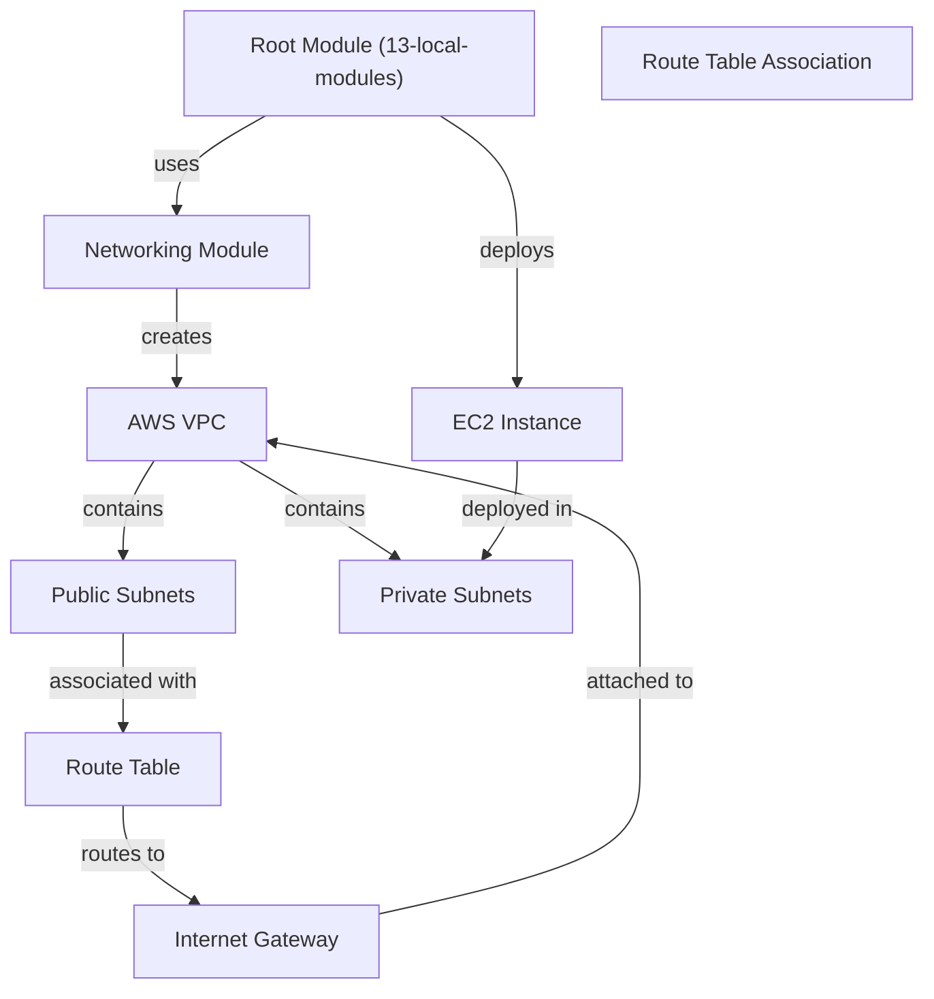

# Mastering Terraform: From Beginner to Expert

### Course link (with a big discount 🙂): https://www.lauromueller.com/courses/mastering-terraform

**Check my other courses:** 

- 👉 The Complete Docker and Kubernetes Course: From Zero to Hero - https://www.lauromueller.com/courses/docker-kubernetes
- 👉 The Definitive Helm Course: From Beginner to Master - https://www.lauromueller.com/courses/definitive-helm-course
- 👉 Mastering GitHub Actions: From Beginner to Expert - https://www.lauromueller.com/courses/mastering-github-actions
- 👉 Write better code: 20 code smells and how to get rid of them -  https://www.lauromueller.com/courses/writing-clean-code

Welcome everyone! I'm very happy to see you around, and I hope this repository brings lots of value for those learning more about Terraform. Make sure to check the link above for a great discourse on the course in Udemy, where I not only provide theoretical explanations around all the concepts here, but also go in details through the entire coding of the examples in this repository.

Here are a few tips for you to best navigate the contents of this repository:
1. The `exercises` folder contains descriptions for all the implemented exercises. You can use it as a guide to try to implement them by yourself before following the solution recordings.
2. The `projects` folder contains six bigger projects that you can also tackle for an extra challenge 🙂 The solutions for these projects are implemented within their respective folders, **except for project 00, which is implemented inside of the folder `06-resources`**.
3. The other folders roughly mirror the structure of the course, but there are some course sections that span more than one folder.

Happy learning! 🚀

## Additional Links and Courses:

**Other repositories included in the course:**
* Networking Module Repository - https://github.com/lm-academy/terraform-aws-networking-tf-course
* Terraform Cloud VCS Integration Repository - https://github.com/lm-academy/terraform-course-example-terraform-cloud

**Other courses I published in Udemy:**
* Mastering GitHub Actions: From Beginner to Expert - https://www.lauromueller.com/courses/mastering-github-actions

## State Manipulation Examples

This directory contains examples demonstrating various Terraform state manipulation techniques:

### Import (`import.tf`)

Demonstrates how to import existing AWS resources into Terraform state using the `import` block. The example imports an S3 bucket public access block configuration into state.

**Key concepts:**
- Using the `import` block to declare resources that should be imported
- Referencing the ID of existing AWS resources
- Managing resources that were created outside of Terraform

### Remove (`remove.tf`)

Demonstrates how to remove resources from Terraform state without destroying the actual infrastructure using the `removed` block.

**Key concepts:**
- Using the `removed` block to unmanage resources
- Setting `destroy = false` to prevent actual resource deletion
- Useful for resources that will be managed elsewhere or decommissioned separately

### Taint (`taint.tf`)

Contains example resources that can be marked as tainted to force Terraform to destroy and recreate them on the next apply.

**Key concepts:**
- Resources marked as tainted will be replaced during the next `terraform apply`
- Useful for forcing recreation of resources that may have drifted or need updates
- Can be tainted via CLI: `terraform taint <resource_address>`

### Module Structure

The `modules/compute/` directory contains reusable compute infrastructure patterns with proper variable typing and documentation.
=======
* Write Clean Code: 20 Code Smells and How to Get Rid of Them - https://lauromueller.com/courses/writing-clean-code/


## Projects

This repository contains a comprehensive collection of hands-on AWS and Terraform projects designed to build practical infrastructure-as-code skills:

### Project 0: Deploying an NGINX Server in AWS

**File:** `projects/proj00-vpc-ec2.md`

Learn to deploy an NGINX server in AWS by creating a new VPC, configuring public and private subnets, and launching an EC2 instance. This project covers VPC setup, security groups, EC2 management, and resource tagging using Terraform.

### Project 1: Deploying a Static Website with S3

**File:** `projects/proj01-s3-static-website.md`

Gain hands-on experience with Amazon S3 and Terraform by hosting a static website. This project covers bucket creation, access management, bucket policies, and infrastructure-as-code principles.

### Project 2: Managing IAM Users and Roles with Terraform

**File:** `projects/proj02-iam-users.md`

Master AWS Identity and Access Management (IAM) by automating user and role creation with Terraform. This project integrates YAML-based configuration with Terraform to manage users, roles, policies, and secure role assumption.

### Project 3: Importing Lambda Resources into Terraform

**File:** `projects/proj03-import-lambda.md`

Learn to import existing AWS resources into Terraform code. This project focuses on importing Lambda functions, understanding infrastructure components, and leveraging Terraform's code generation capabilities.

### Project 4: Creating an RDS Module

**File:** `projects/proj04-rds-module.md`

Build a reusable, production-grade RDS module for Terraform. This project emphasizes module design patterns, variable validation, security best practices, and creating reusable infrastructure components.

### Project 5: Enabling OIDC for AWS Authentication from Terraform Cloud

**File:** `projects/proj05-tf-cloud-oidc.md`

Set up OpenID Connect (OIDC) authentication between Terraform Cloud and AWS for secure, keyless authentication. This project covers identity providers, role trust relationships, and multi-workspace configurations.

# Terraform Cloud Configuration

This directory contains example Terraform configurations for deploying infrastructure using Terraform Cloud.

## Overview

The 18-terraform-cloud example demonstrates how to:
- Configure Terraform to use Terraform Cloud as the remote backend
- Manage AWS infrastructure through Terraform Cloud
- Use variable validation to enforce constraints
- Deploy EC2 instances, S3 buckets, and generate random identifiers

## Files

- **provider.tf**: Terraform Cloud configuration and provider requirements
  - Configures Terraform Cloud with LauroMueller organization
  - Sets up AWS and Random providers
  - AWS region: eu-west-1

- **compute.tf**: EC2 instance configuration
  - Uses latest Ubuntu 22.04 LTS AMI
  - Instance type configurable via `ec2_instance_type` variable
  - Tagged with "terraform-cloud" name

- **s3.tf**: S3 bucket configuration
  - Bucket name includes random suffix for global uniqueness
  - Tagged with CreatedBy metadata

- **random.tf**: Random resource generation
  - Generates a 4-byte random ID in hexadecimal format
  - Outputs the random ID for reference

- **variables.tf**: Input variable definitions
  - `ec2_instance_type`: EC2 instance type (validates t2.micro for free tier)

- **.terraform.lock.hcl**: Dependency lock file
  - Locks AWS provider v5.42.0
  - Locks Random provider v3.6.0

## Prerequisites

- Terraform CLI installed
- Terraform Cloud account and organization setup
- AWS credentials configured (via environment variables or AWS CLI profile)
- Authentication token for Terraform Cloud

## Usage

1. Initialize Terraform:
   ```bash
   terraform init
   ```

2. Plan the infrastructure:
   ```bash
   terraform plan -var="ec2_instance_type=t2.micro"
   ```

3. Apply the configuration:
   ```bash
   terraform apply -var="ec2_instance_type=t2.micro"
   ```

## Notes

- This example uses the free tier eligible `t2.micro` instance type
- S3 bucket names must be globally unique; the random suffix ensures uniqueness
- Terraform Cloud state is managed remotely in the LauroMueller organization
- The workspace name is "terraform-cli"
=======
# Terraform Local Modules Project

A comprehensive example project demonstrating the creation and usage of reusable Terraform modules, specifically focusing on networking infrastructure automation.

## Project Overview

This project is structured around the `13-local-modules` example, which showcases best practices for organizing Terraform code into modular, reusable components. The project deploys a complete AWS networking infrastructure including VPCs, public/private subnets, Internet Gateways, and route tables.

## Project Structure

```
13-local-modules/
├── modules/
│   └── networking/          # Reusable VPC and Subnet module
│       ├── vpc.tf           # Core VPC, subnet, IGW, and routing resources
│       ├── variables.tf     # Input variables with validation
│       ├── outputs.tf       # Module outputs (VPC ID, subnet info)
│       ├── providers.tf     # Provider configuration
│       ├── README.md        # Module documentation
│       ├── LICENSE          # MIT License
│       └── examples/
│           └── complete/    # Complete usage example
├── networking.tf            # Module instantiation
├── compute.tf               # EC2 instance in private subnet
├── outputs.tf               # Root outputs
├── providers.tf             # AWS provider configuration
└── .terraform.lock.hcl      # Dependency lock file
```

## System Architecture



## Networking Module

The networking module provides a flexible, reusable way to create AWS VPC infrastructure. It handles the creation of VPCs with customizable subnet configurations, automatic Internet Gateway deployment for public subnets, and proper route table associations.

### Module Features

- **VPC Creation**: Create a VPC with a configurable CIDR block
- **Flexible Subnet Configuration**: Define multiple subnets with individual CIDR blocks and availability zones
- **Public/Private Subnets**: Mark subnets as public or private via configuration
- **Automatic IGW Deployment**: Internet Gateway is automatically created and attached when at least one public subnet exists
- **Route Table Management**: Public subnets are automatically associated with a route table that routes traffic to the Internet Gateway
- **Validation**: Built-in CIDR block validation and availability zone verification

### Module Inputs

#### `vpc_config` (Required)
Object containing VPC configuration:
- `cidr_block` (string): CIDR block for the VPC (e.g., "10.0.0.0/16")
- `name` (string): Name tag for the VPC

#### `subnet_config` (Required)
Map of subnet configurations keyed by subnet identifier:
- `cidr_block` (string): CIDR block for the subnet
- `public` (optional boolean): Set to `true` for public subnets, default is `false` (private)
- `az` (string): AWS availability zone (e.g., "eu-west-1a")

### Module Outputs

- `vpc_id`: The AWS ID of the created VPC
- `public_subnets`: Map of public subnets with subnet_id and availability_zone
- `private_subnets`: Map of private subnets with subnet_id and availability_zone

### Example Usage

```hcl
module "vpc" {
  source = "./modules/networking"

  vpc_config = {
    cidr_block = "10.0.0.0/16"
    name       = "my-vpc"
  }

  subnet_config = {
    subnet_1 = {
      cidr_block = "10.0.0.0/24"
      az         = "eu-west-1a"
      # public defaults to false, so this is a private subnet
    }
    subnet_2 = {
      cidr_block = "10.0.1.0/24"
      public     = true
      az         = "eu-west-1b"
    }
  }
}

output "vpc_id" {
  value = module.vpc.vpc_id
}
```

## Deploy Instructions

1. **Initialize Terraform**:
   ```bash
   cd 13-local-modules
   terraform init
   ```

2. **Validate Configuration**:
   ```bash
   terraform validate
   ```

3. **Plan Deployment**:
   ```bash
   terraform plan
   ```

4. **Apply Configuration**:
   ```bash
   terraform apply
   ```

5. **View Outputs**:
   ```bash
   terraform output
   ```

## Requirements

- Terraform >= 1.0
- AWS Provider >= 5.0
- AWS credentials configured with appropriate permissions

## AWS Permissions Required

The AWS credentials must have permissions to:
- Create/manage VPCs
- Create/manage Subnets
- Create/manage Internet Gateways
- Create/manage Route Tables
- Create/manage EC2 Instances
- Describe Availability Zones
- Query AMI data

## License

MIT License - See LICENSE file for details
